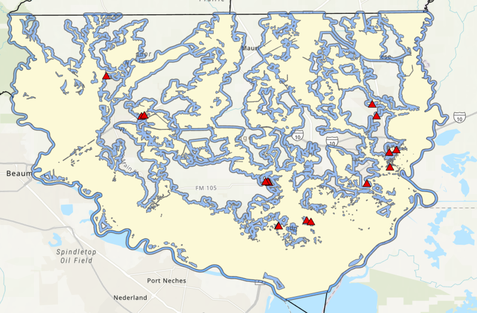

## Geospatial Portfolio

---

### Identifying At-Risk Public Schools Near Flood-Hazard Areas 

Python | ArcPy | ArcGIS Pro | Spatial Analysis

A Python/Arcpy interactive analysis that identifies public school institutions that are located within or within a user-defined buffer distance of FEMA Special Flood Hazard Areas in the Texas, Golden Triangle.
This project allows a user to select a county and provide a buffer zone distance. The analysis processes the appropriate flood data, and identifies those schools that are within the given user-defined criteria.

[View Full Project](https://github.com/hawthorne-michaeld/golden-triangle-flood-risk)

---

### USA 250th Anniversary National Suitability Analysis

ArcGIS Pro | StoryMaps | ArcGIS Online | Spatial Analysis | MCDA

A national, site suitability analysis showcasing locations across the contiguous United States that would be well suited to host America 250 Celebrations for America's 250th Anniversary.
The analysis incorporates the use of population data, park access information, July heat conditions, and major-road and highway density information as a means to analyze site suitability.

The overall analysis incorporates the use of ArcGIS Online and ArcGIS Pro. The analysis is presented through ArcGIS StoryMaps. 

[View Entire Project Repository Here](https://github.com/hawthorne-michaeld/USA-250th-Anniversary-National-Suitability-Analysis)

[View StoryMap using this link](https://storymaps.arcgis.com/stories/21b47ebb092f460b878b639069a0b2e9)

---

---

### Category Name 2

- [Project 1 Title](http://example.com/)
- [Project 2 Title](http://example.com/)
- [Project 3 Title](http://example.com/)
- [Project 4 Title](http://example.com/)
- [Project 5 Title](http://example.com/)

---

---

Page template forked from <a href="https://github.com/evanca/quick-portfolio">evanca</a>

<!-- Remove above link if you don't want to attibute -->
